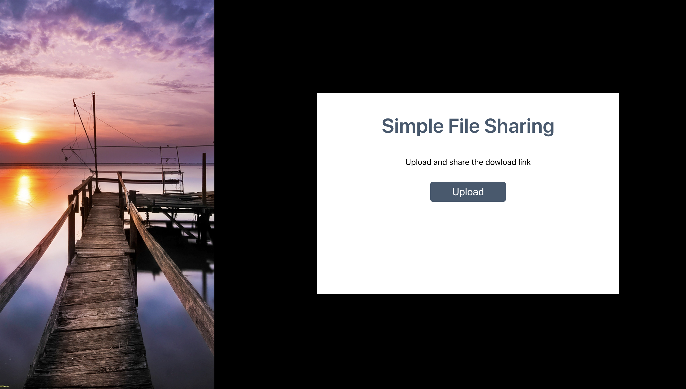
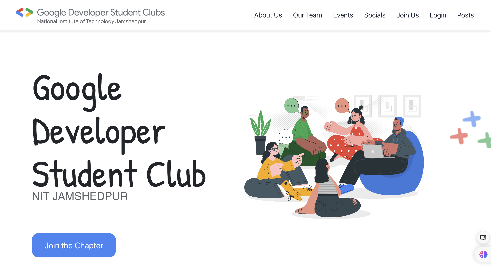

# Shital Kumari - Personal Portfolio

Welcome to my portfolio! I’m a B.Tech student at NIT Jamshedpur specializing in web development and competitive programming. This portfolio highlights my skills, projects, and experiences.

## About Me

I’m passionate about coding, problem-solving, and full-stack development with a focus on the MERN stack and competitive programming.

## Technologies
- **Frontend**: HTML, CSS, JavaScript
- **Backend**: Node.js, Express.js
- **Database**: MongoDB
- **Languages**: C++, Python
- **Others**: Git, REST APIs

## Featured Projects

- **File Sharing App**  
  MERN-based app for secure file upload and sharing.  
  

- **Krishi Connect**  
  Platform connecting farmers and buyers for sustainable agriculture.  
  

- **GDSC Website**  
  Website for a Developer Student Club chapter.  
  

## Installation

To run the portfolio locally, clone the repo and open `index.html`:

```bash
git clone <repository_url>
cd personal-portfolio
open index.html

Contact
Email: shitalkumari@example.com
LinkedIn: linkedin.com/in/shitalkumari
GitHub: github.com/shitaljha2312

Thanks for visiting!
This streamlined version keeps it brief while still covering the key aspects of your portfolio.
